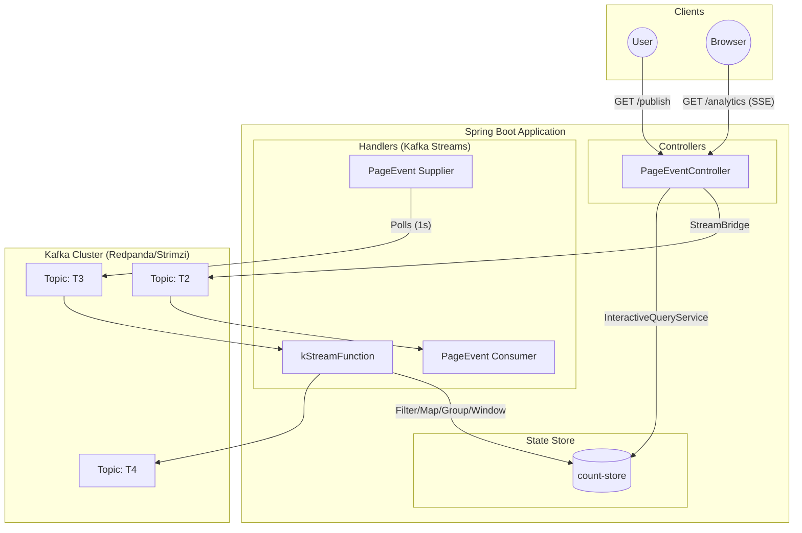

# Event Driven Architecture

This project demonstrates an Event-Driven Architecture using Spring Cloud Stream, Kafka Streams, and Spring Boot. It includes a real-time analytics pipeline that processes page view events.

## Architecture

The following diagram illustrates the data flow and component interactions within the application.



## Components

### 1. PageEvent
The core data model representing a page view event.
- **Fields**: `name`, `userName`, `date`, `duration`.

### 2. PageEventController
REST Controller handling external interactions.
- **Publishing** (`/publish`): Accepts parameters (`name`, `topic`) to create a `PageEvent` and sends it to the specified topic (defaulting to `T2` configuration) using `StreamBridge`.
- **Analytics** (`/analytics`): Exposes a Server-Sent Events (SSE) endpoint. It uses `InteractiveQueryService` to query the local `count-store` (WindowStore) and streams real-time page visit counts grouped by page name over the last 5 seconds.

### 3. PageEventHandler
Contains the Spring Cloud Stream functional bean definitions.
- **pageEventConsumer**: Subscribes to topic `T2` and logs received events.
- **pageEventSupplier**: Periodically generates random `PageEvent` objects and sends them to topic `T3`.
- **kStreamFunction**: A Kafka Stream processor that:
    1.  Consumes from topic `T3`.
    2.  Filters events with duration > 100.
    3.  Groups by page name.
    4.  Applies a Time Window (5000ms).
    5.  Counts occurrences and materializes the result into a State Store named `count-store`.
    6.  Forwards the stream to topic `T4`.

## Interaction Flow

1.  **Event Generation**: 
    -   The `pageEventSupplier` automatically generates events to `T3`.
    -   Users can manually trigger events via the `/publish` endpoint, sending them to `T2`.
2.  **Processing**:
    -   Events on `T3` are consumed by `kStreamFunction`.
    -   The function processes the stream and updates the local state store `count-store` with windowed counts.
3.  **Consumption**:
    -   The `pageEventConsumer` simply logs events from `T2`.
4.  **Visualization**:
    -   A client connects to `/analytics`.
    -   The controller queries the `count-store` every second and pushes the current windowed counts to the client.

Strimzi Kafka Architecture

The project is designed to run on Kubernetes with a Kafka cluster managed by [Strimzi](https://strimzi.io/).

### Configuration Overview
The Kubernetes configuration (`k8s/kafka/kafka-single-node.yaml`) defines a simplified, single-node Kafka cluster suitable for development and testing.

- **Mode**: KRaft (Kafka Raft Metadata mode). This deployment does **not** use Zookeeper. Kafka manages its own metadata.
- **KafkaNodePool (`dual-role`)**:
    -   Defines a node pool where the node acts as both a **Controller** (managing the cluster) and a **Broker** (storing data).
    -   **Replicas**: 1.
    -   **Storage**: 100Gi Persistent Volume (JBOD).
- **Kafka Cluster (`my-cluster`)**:
    -   **Version**: 4.1.1.
    -   **Listeners**:
        -   `plain` (port 9092): Internal, no TLS.
        -   `tls` (port 9093): Internal, with TLS.
    -   **Entity Operator**: Enabled to manage `KafkaTopic` and `KafkaUser` resources via Kubernetes CRDs.
    -   **Replication Config**: configured for a single node (offsets, transaction logs, and default replication factors are all set to 1).

### Deployment
To deploy this cluster (assuming Strimzi Operator is installed):
```bash
kubectl apply -f k8s/kafka/kafka-single-node.yaml
```

## Containerization & CI/CD

This project uses [Google Jib](https://github.com/GoogleContainerTools/jib) to containerize the Spring Boot application. Jib builds optimized Docker and OCI images for your Java applications without a Docker daemon - and without mastering deep mastery of Docker best-practices.

### Jib Configuration
The `jib-maven-plugin` is configured in `pom.xml`. It builds the image and pushes it directly to the configured registry.

### GitLab CI/CD Pipeline
The project includes a `.gitlab-ci.yml` pipeline that automates the build and push process.

- **Docker-less Build**: Since Jib does not require a Docker daemon, we can use a standard Maven image (`maven:3.9.6-eclipse-temurin-17`) in our CI runner. This eliminates the need for "Docker-in-Docker" (dind), improving security and performance.
- **Pipeline Job**: The `build-and-push` job runs:
  ```bash
  mvn compile com.google.cloud.tools:jib-maven-plugin:build \
      -Dimage=$CI_REGISTRY_IMAGE:$CI_COMMIT_SHORT_SHA \
      -Djib.to.auth.username=$CI_REGISTRY_USER \
      -Djib.to.auth.password=$CI_REGISTRY_PASSWORD
  ```

## Kubernetes Application Deployment

The application backend is containerized and ready for Kubernetes deployment. The manifests are located in `k8s/backend/`.

### Prerequisites
1.  **Namespace**: Create the namespace `event-driven`.
    ```bash
    kubectl create namespace event-driven
    ```
2.  **Secrets**: Ensure you have a `gitlab-registry-key` secret in the `event-driven` namespace if pulling from a private registry (as referenced in `eventdriven-backend.yaml`).

### Deployment Steps
Apply the ConfigMap, Service, and Deployment manifests:

```bash
kubectl apply -f k8s/backend/
```

This will create:
-   **ConfigMap** (`backend-cm`): Stores configuration like `KAFKA_URL`.
-   **Deployment** (`backend`): Deploys 3 replicas of the Spring Boot application.
-   **Service** (`event-driven-backend`): Exposes the application (ClusterIP).

## Kafka UI

To visualize topics, messages, and consumer groups, we recommend using [Kafka UI](https://github.com/provectus/kafka-ui).

### Installation (Helm)

1.  Add the Helm repository:
    ```bash
    helm repo add kafka-ui https://ui.charts.kafbat.io/
    ```

2.  Install Kafka UI:
    ```bash
    helm install my-kafka-ui kafka-ui/kafka-ui --version 1.5.3 \
      --set envs.config.KAFKA_CLUSTERS_0_NAME=my-cluster \
      --set envs.config.KAFKA_CLUSTERS_0_BOOTSTRAPSERVERS=my-cluster-kafka-bootstrap:9092
    ```

